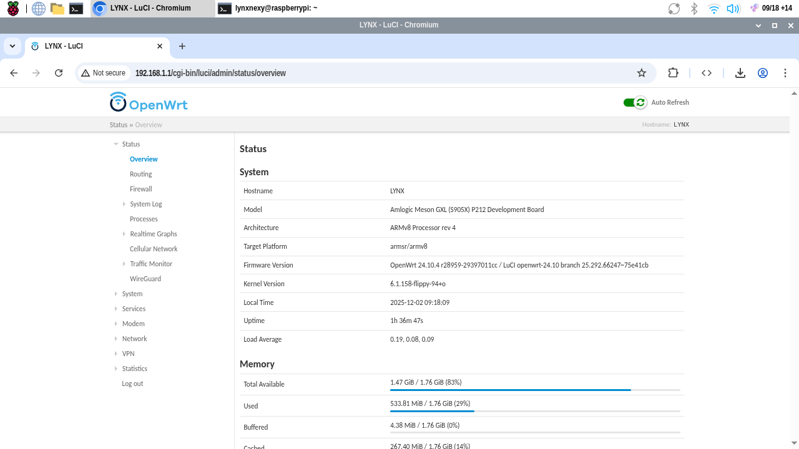
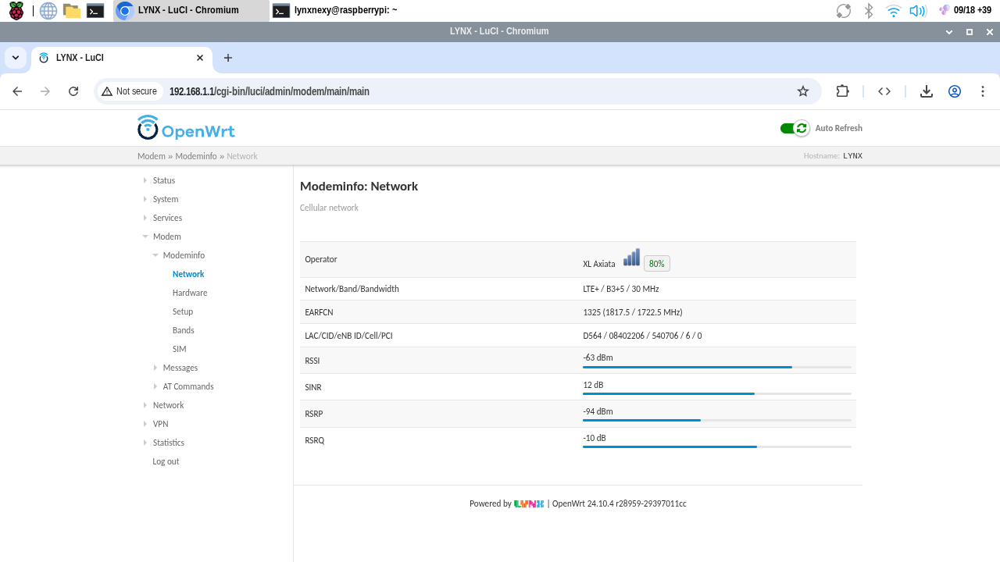
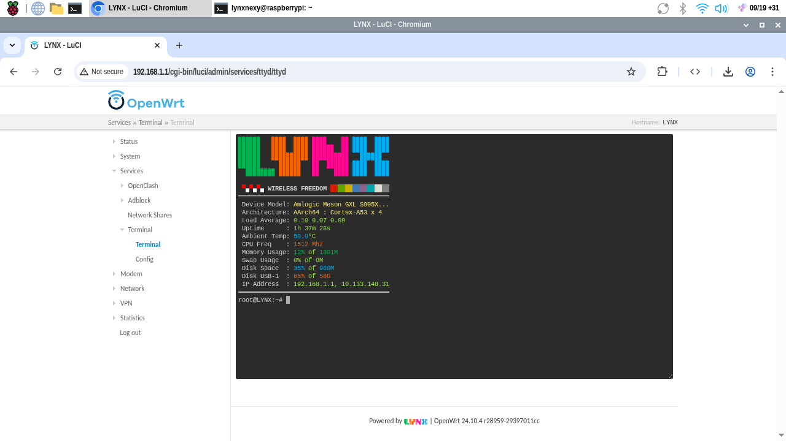
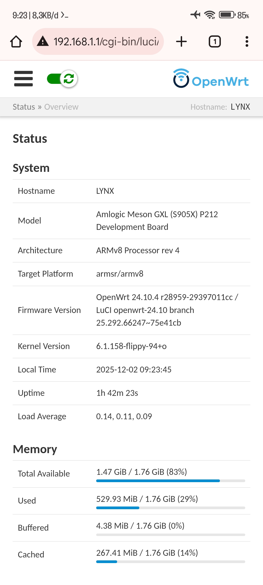
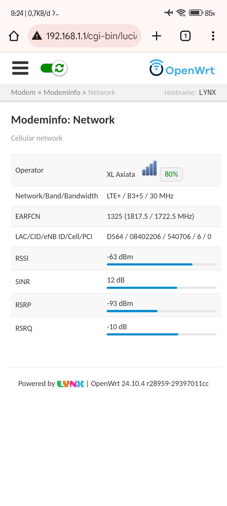
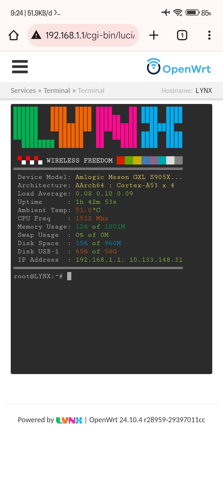

## OpenWrt 24.10.4

OpenWrt 24.10.4 stable release for `Amlogic` and `Rockchip` with more packages ported, more devices supported, better performance, and special optimizations for users.

<table>
<tr>
<td valign="top">

### Supported Devices

| Device | Firmware Code |
|--------|---------------|
| HG680P | `s905x` |
| B860H | `s905x-b860h` |
| HG680-FJ | `s905x2-hg680fj` |
| Nexbox A95X-A2 | `s912-nexbox-a2` |
| NanoPi R5S | `nanopi-r5s` |
| NanoPi R5C | `nanopi-r5c` |
| Orange Pi 5 Plus | `orangepi-5-plus` |

</td>
<td valign="top">

### Firmware Information

| Setting | Value |
|---------|-------|
| Default IP | `192.168.1.1` |
| Default username | `root` |
| Default password | `passwd` |
| Default WIFI name | `LYNX` |
| Default WIFI password | `none` |

</td>
</tr>
</table>

## Amlogic Service

Install to EMMC:  
Login to `OpenWrt` → `System` → `Amlogic Service` → `Install OpenWrt`

Online Update:  
Login to `OpenWrt` → `System` → `Amlogic Service` → `Online Download Update`

Manual Update:  
Login to `OpenWrt` → `System` → `Amlogic Service` → `Manually Upload Update`

## Screenshots

### Desktop

### Mobile

